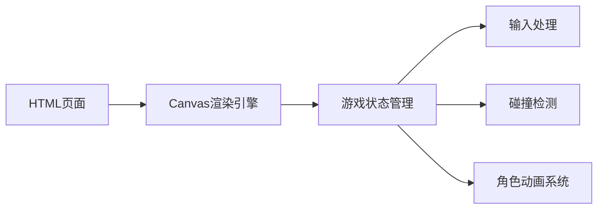

## 1. Architecture Design


## 2. Technology Description
- 前端：纯HTML5 + CSS3 + JavaScript (ES6+)
- 渲染：Canvas 2D API
- 无需后端或数据库，纯前端实现
- 初始化方式：直接创建HTML文件

## 3. File Structure
| 文件名 | 用途 |
|--------|------|
| index.html | 游戏主页面，包含Canvas元素和游戏逻辑 |

## 4. Core Classes and Functions
### 4.1 角色类 (Mech)
```javascript
class Mech {
    constructor(x, y, color, name, controls) {
        this.x = x;
        this.y = y;
        this.color = color;
        this.name = name;
        this.controls = controls;
        this.health = 100;
        this.width = 40;
        this.height = 60;
        this.velocity = { x: 0, y: 0 };
        this.isAttacking = false;
        this.isDefending = false;
        this.attackCooldown = 0;
        this.animationFrame = 0;
    }
    
    update() {
        // 更新角色状态
    }
    
    draw(ctx) {
        // 绘制角色
    }
    
    attack(target) {
        // 攻击逻辑
    }
    
    takeDamage(amount) {
        // 受伤逻辑
    }
}
```

### 4.2 游戏主类 (Game)
```javascript
class Game {
    constructor(canvas) {
        this.canvas = canvas;
        this.ctx = canvas.getContext('2d');
        this.keys = {};
        this.mechs = [];
        this.gameOver = false;
        this.winner = null;
    }
    
    init() {
        // 初始化游戏
    }
    
    update() {
        // 游戏主循环更新
    }
    
    render() {
        // 渲染游戏画面
    }
    
    checkCollisions() {
        // 碰撞检测
    }
    
    reset() {
        // 重置游戏
    }
}
```

## 5. Key Controls
| 玩家1 (红方) | 功能 | 玩家2 (蓝方) | 功能 |
|--------------|------|--------------|------|
| A | 左移 | ← | 左移 |
| D | 右移 | → | 右移 |
| W | 跳跃 | ↑ | 跳跃 |
| S | 防御 | ↓ | 防御 |
| Space | 攻击 | Enter | 攻击 |

## 6. Game Mechanics
- **移动**：角色有水平移动和跳跃能力
- **攻击**：有冷却时间的近战攻击，造成伤害
- **防御**：减少受到的伤害
- **血量系统**：初始100点血量，归零即失败
- **重力系统**：角色受重力影响下落
- **边界限制**：角色不能移出画布
