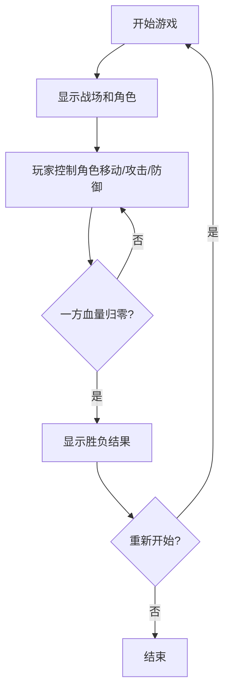

## 1. Product Overview
像素风机甲对战小游戏 - 一款支持双人对战的复古像素风格动作游戏
- 提供简单易上手的机甲对战体验，包含移动、攻击、防御等核心操作
- 适合休闲娱乐，适合各类玩家快速体验

## 2. Core Features

### 2.2 Feature Module
1. **游戏主页面**: 游戏画布、角色状态面板、控制说明
2. **游戏结束页面**: 显示胜负结果、重新开始选项

### 2.3 Page Details
| Page Name | Module Name | Feature description |
|-----------|-------------|---------------------|
| 游戏主页面 | 游戏画布 | 渲染像素风格的战斗场景、两个机甲角色、角色动画 |
| 游戏主页面 | 角色状态面板 | 显示双方机甲的血量条、角色名称 |
| 游戏主页面 | 控制说明 | 显示玩家操作按键说明 |
| 游戏结束页面 | 胜负结果 | 显示胜利方机甲、重新开始按钮 |

## 3. Core Process
玩家进入游戏后，两个机甲在战场两端对峙，通过键盘控制角色移动、攻击和防御。当一方血量归零，游戏结束，显示胜负结果并提供重新开始选项。

## 4. User Interface Design
### 4.1 Design Style
- 复古像素风格，8位机质感
- 主色调：黑色背景，配合红、蓝、黄等鲜明像素色彩
- 字体：等宽像素字体
- 布局：居中游戏画布，上下信息面板
- 图标：像素化设计，使用字符或简单图形

### 4.2 Page Design Overview
| Page Name | Module Name | UI Elements |
|-----------|-------------|-------------|
| 游戏主页面 | 游戏画布 | 600x400像素画布，像素风格战场（地面、天空），左右各一个机甲角色 |
| 游戏主页面 | 状态面板 | 顶部血量条（红色和蓝色），显示玩家名称和当前血量百分比 |
| 游戏主页面 | 控制说明 | 底部左右两侧的控制说明，使用清晰的按键标识 |
| 游戏结束页面 | 结果面板 | 居中显示胜利文字，像素风格的重新开始按钮 |

### 4.3 Responsiveness
桌面端优先，适配主流浏览器窗口大小，使用Canvas确保游戏画面在不同分辨率下保持清晰。

### 4.4 像素艺术实现
- 使用Canvas绘制像素风格图形
- 机甲角色采用简单几何图形组合，添加动画帧
- 攻击和防御效果使用像素级动画实现
- 背景使用渐变和简单像素纹理营造复古氛围
